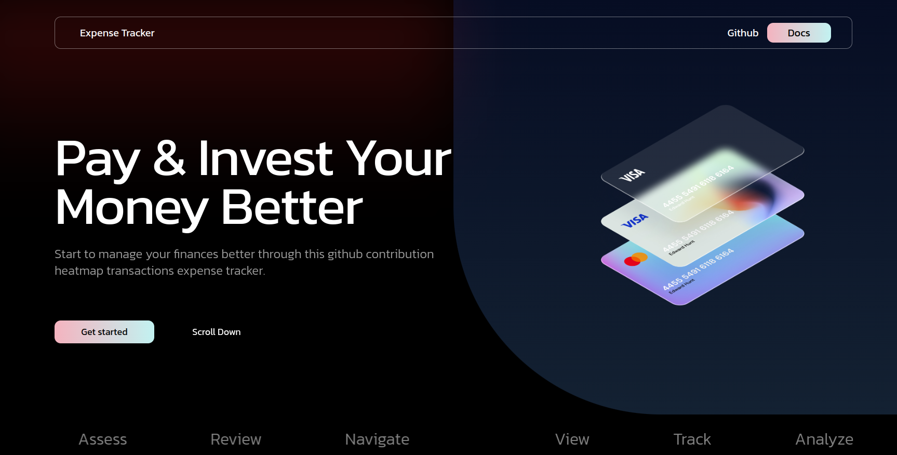

***
This is a react app that represents a github contribution heatmap like calender showing all transactions made in the past one year,click on any date and track the expenses of that particular day.



## Tech stack
***
- **Code** : React
- **Styling & Designing** : Tailwind CSS,Figma
- **Animations** : Lottie files,data-aos
- **Documentation** : Docusaurus
- **Testing** : React Testing Library,Jest 
## Local development
***
- Clone the repository from this [link](./01-Overview.md).
- Open it in a code editor of your choice.
- In the terminal (inside the root directory) type ```npm start``` to spin up the local development server at ```localhost:3000```  
## Testing 
****
- In the terminal (inside the root directory) type ```npm test``` this will start running all the test suites and display the error if any in the terminal itself.   
  
**Requires Node version >= 18.0*
