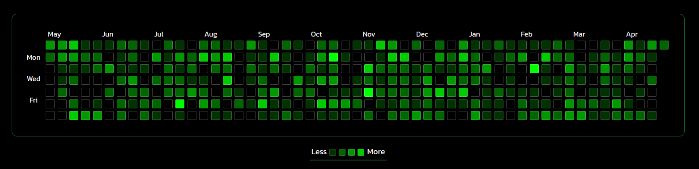

# Heatmap
***
For generating the *github contribution like heatmap*,I have depicted each day of the past one year through a small div,
53 weeks each with 7 days make a complete 53*7 table representing each day in the last one year,each block represents a particular date (represented by ```dateBlocks[i][j]```) and contain a track of the number of transactions made on that date (adding both debits and credits)(represented by ```dateTransactions[i][j]```) based on this value each div is given an hsl value from the hue,saturation,lightness states.


Total yearly debit and credit amounts are calculated and stored in ```yearlyDebit``` and ```yearlyCredit``` state variables respectively.  Total number of transactions made in the year are also shown.

