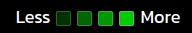

# Color intensity of the blocks
***
To set the color intensities for each block based on the number of transactions made on that day first of all we provide each block with the number of transactions made on that day this is done by filtering the array of JSON data by using the ```reduce()``` function available in JavaScript,if any of the object matches with the date of that particular block we increment the count by 1.
### ```setDateWiseTransactions()```
```jsx
const setDateWiseTransactions = async () => {
  for (let i=0; i<53; i++){
    for(let j=0; j<7; j++ ){
      const count = transactions.reduce((count, transaction) => count + (moment(transaction.date).format('DD-MM-YY') ===    moment(startDate,'DD-MM-YY').add((7*i+j),'days').format('DD-MM-YY') ? 1 : 0), 0);
      dateTransactions[i][j]=count;
    } 
  }
}  
```
Now we got the number of transactions on each day(stored in ```dateTransactions[i][j]```),these values are used to provide background colors with different intensities,A more lighter green represents more number of transactions as compared to a darker shade of green as shown below :



## hsl() coloring
***
```hsl()``` coloring method is used to give background colors to the block here **h=hue, s=saturation, l=lightness**
```jsx
style = {{ 
    backgroundColor:`hsl(${hue[i][weekDayIndex]},${saturation[i][weekDayIndex]}%,${light[weekDayIndex]}%)`, 
}}
```
*- here **i** is the column index ranging from 0 to 52*  
**- *weekDayIndex** is the index representing day of the week ranges from 0 to 6 for e.g. Sunday=0,Monday=1,Tuesday=2 and so on*  
-```hue[i][weekdayIndex]```,```saturation[i][weekdayIndex]```,```lightness[i][weekdayIndex]```  are the state variables as declared in ```Home``` component
```jsx
const [ hue,setHue] = useState( Array.from({ length: 53 }, () => Array(7).fill(120)) )
const [ saturation,setSaturation] = useState( Array.from({ length: 53 }, () => Array(7).fill(100)) )
const [ lightness,setLightness] = useState( Array.from({ length: 53 }, () => Array(7).fill(50)) )
```

### Logic for setting color intensities
***
```setColors()``` method is used to set hue,saturation and lightness values for all the date blocks here ```dateTransactions[i][j] ``` is another state variable that represents the number of transactions corresponding to that date block. 

### ```setColor()```
***
Variable ```normalizedCount``` receives a number b/w **0.1** to **1** (both inclusive),based on the number of transactions,for e.g. if the number of transactions let's say is 1 than ```normalizedCount = Math.min(1*0.1,1)``` i.e. 1,0.2 for 2 transactions and so on,based on this values the ```lightness[i][j]``` is assigned a value b/w 0 to 100%,thus 1 transaction corresponds to ```normalizedCount = 0.1``` translates to ```lightness[i][j] = 10%``` similarly ```lightness[i][j] = 20%``` for 2 transactions and so on,thereby increasing the lightness proportionally to the number of transactions hence creating a color gradiation for the heatmap generation.   

```jsx
const setColors = async () => {
  for(let i=0;i<53;i++){
    for(let j=0;j<7;j++){
      const normalizedCount =  Math.min(dateTransactions[i][j]*0.1, 1);
      if(normalizedCount===0){  //if there are no transactions on a particular date
        hue[i][j]=0;
        lightness[i][j]=0;
        saturation[i][j]=0;
      }
      else lightness[i][j]=normalizedCount*100
    }
  }
}
```