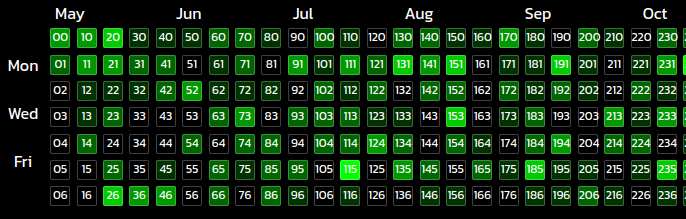

# Dates of the blocks
***
This section explains how each div(block) corresponds to a particular date and are arranged together to make a whole calender year.

### Setting variable ```daysInYear```
***
```jsx
const daysInYear = moment().isLeapYear() ? 366 : 365;
```
The variable ```daysInYear``` is assigned the value of ```366``` or ```365``` based on the fact whether or not the current year is a leap year which is checked by the ```moment().isLeapYear()``` method available in the ```moment``` library (returns        ```true``` if the current year is a leap year)


### Setting variable ```startDate``` for the first block ( cell-00 )
***
```jsx
const startDate = moment().add(-moment().day(),'days').add(-daysInYear+dayAddFactor,'days').format('DD-MM-YY')
```
The variable ```startDate``` is assigned the value of the date of the Sunday of the corresponding week in the last year.   
- For e.g. let's say today is **Tuesday May 7th,2024** so the weekday index for today is 2 *(Sunday's weekday index=0,Monday=1,Tuesday=2,and so on)* this index can be found out using ```moment().day()``` method.
- Now we first go the first day the current week which is **Sunday May 5th,2024** this is done using ```moment().add(-moment().day(),'days')``` method.
- Then we need to find the date of the Sunday in the corresponding week in last year which is done using subtracting another *365* or *366* days from the Sunday of the current week this is done using ```.add(-daysInYear+dayAddFactor,'days')``` method thus startDate in this case comes out to be **Sunday May 7th,2023** which represents the start date of the first date block i.e. **cell-00**.


### Setting dates in subsequent blocks wrt to startDate
*** 
### ```setDates()```
Now each week column is given an index starting from 0 to 52 and each day is given an index from 0 to 6.
```setDates()``` function is used to assign date to each block starting with ```startDate``` (present at block 00),block 01 will represent ***startDate+1*** similarly block 02 will represent ***startDate+2*** and so on till last day of a week that will be ***startDate+6*** after which we move to the column of the next week here block 10 is essentially startDate+7 this relation of each subsequent block with block 00 can be generalised as ```dateBlocks[i][j] = startDate+7*i+j```   

**here **i = column index and j = weekday index** and in this manner all dates till today's block are calculated.*




Finally ```setDates()``` method runs a for loop for all the blocks and set their corresponding dates storing them in the state variable ```dateBlocks[i][j]``` based on the logic explained above.
```jsx
const setDates = async () => {
  for (let i=0; i<53; i++){
    for(let j=0; j<7; j++ ){
      dateBlocks[i][j]=moment(startDate,'DD-MM-YY').add(7*i+j,'days').format('DD-MM-YY')
    } 
  }
}
```