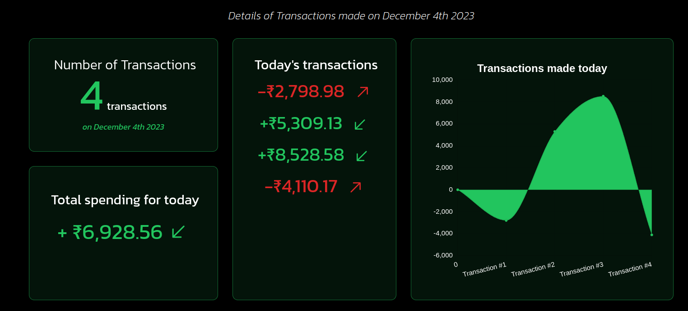

# Transaction Details
***
This component is rendered whenever the user clicks on a date block the date of that particular block and the queried JSON data corresponding to that date is passed down as Props.
```jsx
<div className='m-auto mt-20' id="transaction-details">
  {
    isOpen ? <DateTransactions key={data} data={data} isOpen={isOpen} /> : <div></div>    
  }
</div>
```
**Conditional rendering of the component based on ```isOpen``` value*

## Accepted Props 
***
| Prop | Values | Description |
|-|-|-|
|```data```|[ ] | Contains an array of all the objects with the dates matching to that of the clicked block|
|```isOpen```|Boolean| Checks whether block representing a particular date is clicked or not

If no data object is found to have the the matching date then ```data``` prop holds an empty array having a zero length thus a check is made if ```data.length === 0``` and ```isOpen = true``` to show a fallback text of **_"No transactions made on this date"_**,else if ```data.length !== 0``` the transaction details for the particular date are shown. 
```jsx
{ 
  data.length===0 && isOpen ? (
    <div>
      <div>Whoops!</div>
      <div>No transactions made on this date</div>
    </div>
  ) : 
    ( data.length && isOpen) && (
        <div>Transaction Details</div>
}
```
## Components of Transaction Details
***
| Component | Description |
|-|-|
| 1. Number of Transactions | Includes the number of all debit and credit transactions on that day |
| 2. Total Spending for today | Difference b/w the sum of all credit transactions and sum of all debit transactions on that day |
| 3. Today's Transactions | List of all transactions made on the day |  
| 4. Graph (Area Chart) | Display the amount of each transaction on that day |

### 1. Number of Transactions
Since the ```data``` prop is the array containing all the objects with dates matching with the date of the clicked block,the length of the array represents the number of transactions made on the particular day.
```jsx
<div className='text-2xl text-center mt-8'>
  <span className='text-[4em] font-extrabold text-green-500'>{data.length}</span>
  <span className='text-2xl ml-2'>transaction{ data.length>1?'s':''}</span> 
  <div className='text-lg mt-4 text-green-500 italic'>on { moment(data[0].date).format('MMMM Do YYYY') }</div>
</div>
```
### 2. Total Spending for today
```calcDateSpending()``` is used to calculate the total spending for that day,all debit transactions are negatively added to the day's spending and credit transactions are positively added to the total spending.
```jsx
const calcDateSpending = (data) => {
  let sum=0;
  for(let i=0;i<data.length;i++){
    if(data[i].type==="debit") sum-=data[i].amount;
    else sum+=data[i].amount;
  }
  return sum;
}
```
### 3. Today's Transactions
Mapping the ```data``` prop and display all the transactions (either as debit or credit)
```jsx
<div>
{ 
  data.map((_,i) => (
    <>
      <div key={i} className='flex items-center justify-center mt-2'>
        <span className={`sm1:text-[2em] sm2:text-[2.5em] md:text-[2.6em] ${data[i].type==="debit" ? 'text-red-600' : 'text-green-500'}`}>
          <span className='font-bold'>{data[i].type==="debit" ? '-' : '+'}</span>
          <span className='font-bold'>{data[i].amount.toLocaleString('en-US', { style: 'currency', currency: 'INR' })}&nbsp;&nbsp;</span>
        </span>
        { 
          data[i].type === "debit" ? 
          <span className='mt-2 sm1:text-[2em] md:text-[2.5em] font-extrabold text-red-600'><RxArrowTopRight/></span> : 
          <span className='mt-2 sm1:text-[2em] md:text-[2.5em] font-extrabold text-green-500'><RxArrowBottomLeft/></span> 
        }
      </div>
    </>
  ))
}
</div>
```
### 4. Area Chart
Rendered using ```react-chartjs-2``` package

## Output
***
The following output appears when the user clicks on the block that corresponds to **December 4th 2023**
