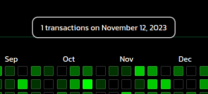

# Tooltip
## Accepted Props
***
| Props | Data Type | Description |
|-|-|-|
|```transactionsCount``` | Number | Number of transactions made on that day |
|```tooltipView``` | Boolean | true if the block is hovered |
|```date```| String | Date to which the hovered block corresponds |
## Output
***
Whenever the user hover over a block ```onMouseEnter()``` event is fired setting the ```toolTipview = true``` and ```transactionsCounts```, ```date``` are also set accordingly and the tooltip is displayed.

